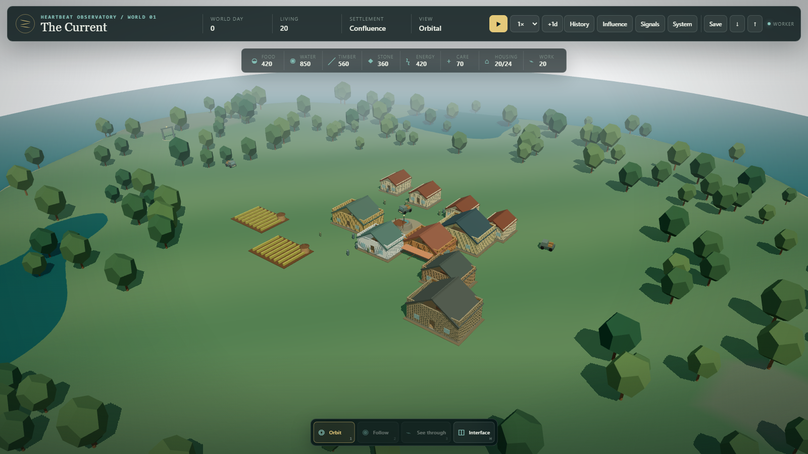

# The Current

The Current is a local-first, deterministic civilization simulation presented as a Three.js spectator world. Its inhabitants enter, move, work, meet, form households and relationships, reproduce, build, manage local waste and environmental pressure, lead, experiment, inherit, and die without a player character. An observer can watch from orbit, follow an NPC, or see through an NPC's eyes, but cannot steer that person.

This is a working first implementation, not the finished civilization described by the specification. The population loop, persistence, worker isolation, causal inputs, and 3D spectator experience run today. Businesses, laws and ideologies, multiple settlements, road-based navigation, and long-form historical replay remain future work. See [the exact implementation status](docs/STATUS.md).

**One shared world.** In production the application spectates a single server-hosted authoritative world that advances at one world day per real day. Fresh cryptographic entropy is created only when a day is resolved and is then recorded for replay, so no hidden script or saved seed contains the future. Every viewer sees the same world, and nobody can pause, accelerate, or fork it from a spectator client. Append `?world=local` to run a private local world instead (development builds default to local).



## Repository

- Public source: <https://github.com/JaronKBragg7337/the-current>
- Live preview: <https://jaronkbragg7337.github.io/the-current/>
- Authoritative specification: [docs/MASTER_SPECIFICATION.md](docs/MASTER_SPECIFICATION.md)
- This repository is separate from Heartbeat Observatory and can be deployed independently at `/`, `/the-current/`, or `/worlds/the-current/`.

## Run locally

Requirements: Node.js 24 or newer, npm 11, and a WebGL2-capable browser.

```powershell
git clone https://github.com/JaronKBragg7337/the-current.git
cd the-current
npm ci
npm run dev
```

Open the URL printed by Vite. The simulation starts paused. It works without live network data after the application files load.

This repository was developed on a Google Drive virtual filesystem, where dependency extraction can corrupt `node_modules`. If installation there fails, use the committed NTFS-cache runner:

```powershell
powershell -NoProfile -ExecutionPolicy Bypass -File .\scripts\run-from-local-cache.ps1
powershell -NoProfile -ExecutionPolicy Bypass -File .\scripts\run-from-local-cache.ps1 -Script test
```

The runner keeps the Git worktree in place, mirrors source without secrets or generated caches, and installs dependencies in a managed local NTFS cache. Full setup details are in [docs/DEVELOPMENT.md](docs/DEVELOPMENT.md).

## What works now

- A seeded authoritative simulation with 20 initial people and condition-driven, stochastic migration; no arrival is guaranteed.
- Lifespans, visible life stages, needs, food and water, employment assignments, prices, relationships, reproduction, births, early and natural deaths, inheritance, construction, institutions, influence, leaders, followers, and rare breakthrough attempts.
- Building-centered land patches with soil fertility, groundwater quality, contamination, local waste stocks, neighbor spread, sanitation labor, facility inputs, drinking-water mixing, and health consequences.
- A selectable one-draw-call soil, water, or contamination layer plus exact local readings on every building panel.
- Spatial prerequisites: NPCs travel before working, building, researching, governing, trading, caring, or meeting; encounters require proximity or a shared home/worksite.
- Timestamped events, deterministic snapshots and replay, a 150-day acceptance run, and a twelve-future distribution audit that requires divergent outcomes from future entropy.
- A module-worker runtime with an in-process startup fallback, throttled projections, single-flight/coalesced IndexedDB autosaves, snapshot retention, JSON export, and queue-barrier-protected import.
- Causal observer interventions and normalized external signals. The bundled signal fixture is offline and deterministic; credential-free ingestion adapters run outside the browser.
- A procedural Three.js island settlement with terrain, water, roads, farms, staged buildings with door openings and simple interiors, articulated stylized NPCs, instanced far population, resource sites, event markers, and presentation-layer traffic.
- Orbital, third-person follow, and view-only first-person cameras with smooth transitions, obstruction handling, selection, inspections, controls, and responsive UI.

Era Zero's accelerated run is archived as historical evidence. Era One uses engine `0.3.0`, real-day biology, bounded storage, fair rationing, causal migration and construction, separated social accounting, physical sanitation response, visible daily journeys, and discoverable remains from Era Zero. Current gates and qualifications are recorded in [docs/ERA_ONE_AUDIT.md](docs/ERA_ONE_AUDIT.md) and [docs/VERIFICATION.md](docs/VERIFICATION.md).

## Controls

- Drag to orbit; right-drag or Shift-drag to pan; wheel or pinch to zoom.
- Click or tap an entity to select it; double-click an NPC to follow.
- `1`, `2`, `3`: orbital, third-person, and first-person spectator views.
- History, Influence, Signals, and System panels are available from the world toolbar on desktop and touch layouts.
- Closing an entity's Details card leaves its spectator camera active; use Details in the camera dock to reopen it.
- `Space`: pause/resume. `[` / `]`: change speed.
- `H`: hide/show UI. `Escape`: dismiss the active details or information panel.

Camera modes remain observational. Complete desktop and touch controls are in [docs/CONTROLS.md](docs/CONTROLS.md).

## Verify

```powershell
npm run lint
npm run typecheck
npm run test
npm run assets:validate
npm run licenses:validate
npm run build
npm run sim:150
npm run test:e2e
```

The current checkpoint has 98 passing Vitest tests across 25 files. The Playwright matrix covers desktop and Pixel 7 Chromium, including the authoritative environmental overlay. GitHub's release workflow independently gates quality and both browser projects before Pages deployment; deterministic replay, browser evidence, and screenshots are cataloged in [docs/VERIFICATION.md](docs/VERIFICATION.md).

## Architecture and operations

- [Architecture and authority boundaries](docs/ARCHITECTURE.md)
- [Simulation rules](docs/SIMULATION_RULES.md)
- [Development and test commands](docs/DEVELOPMENT.md)
- [Deployment and base paths](docs/DEPLOYMENT.md)
- [Performance measurements](docs/PERFORMANCE.md)
- [Data-source research and ingestion](docs/DATA_SOURCES.md)
- [Asset research, pipeline, and provenance](docs/ASSETS.md)
- [Library and asset licenses](docs/LICENSES.md)
- [Design decisions](docs/DECISIONS.md)
- [Instructions for future agents](AGENTS.md)

## Important limitations

The current economy is a causal prototype, not yet a complete market: prices respond to scarcity, but households do not bid for rationed inventory, resource allocation is pooled, and an adult can be counted as employed without a concrete employer. Buildings can produce baseline output without a labor roster. There are no autonomous businesses, debt contracts, laws, ideologies, crime organizations, or multiple settlements yet.

Roads and vehicles are presently presentation systems. NPC movement uses straight-line daily travel rather than the rendered roads, and traffic/cargo is derived from aggregate transport resources rather than authoritative vehicle inventories. Procedural appearance is renderer-derived rather than a saved inheritable genome, and death has no body or funeral sequence. The UI shows recent history but does not yet provide full historical replay.

Private `?world=local` saves are per-origin IndexedDB data. Intervention energy and cooldowns are client-local UI state, not shared public authority. The production spectator reads one Supabase-hosted authoritative world, while live external inputs remain manually ingested snapshots rather than a scheduled public feed. These boundaries are intentional and documented so visible polish is not mistaken for simulated depth.

## Safety and license

Never commit credentials, tokens, browser profiles, local saves, or raw source-asset caches. See [.gitignore](.gitignore) and [SECURITY.md](SECURITY.md).

Project source is MIT licensed. The current runtime art is original procedural geometry; researched third-party asset packs have not been incorporated. Every future asset must be recorded with source, license, hash, modifications, and runtime derivatives before use.
